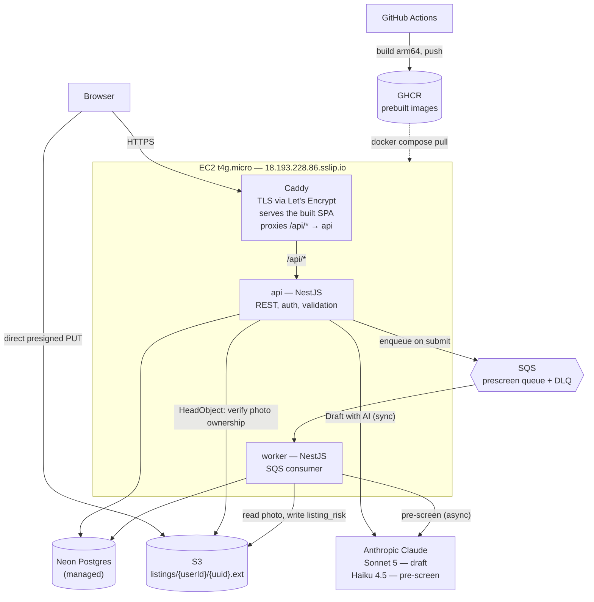
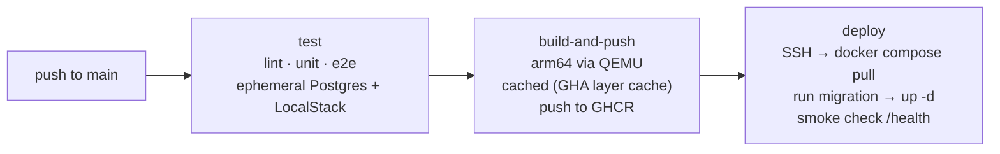

# Marketplace Catalog

A marketplace catalog where contributors submit listings and moderators curate what
gets published. Anyone can browse the published catalog anonymously; there is no
purchasing flow — this is a curated listing board, not a checkout system. Contributors
submit with AI-assisted drafting from a photo; every submission goes through a
deterministic legality screen plus an asynchronous AI risk pre-screen before a human
moderator approves or rejects it.

## Live URL

**https://18.193.228.86.sslip.io**

The catalog needs no login — browse it directly at the URL above. Credentials for the
contributor, moderator, and admin accounts (used to exercise the submit → moderate →
publish flow) are provided alongside this submission.

## Running it locally

No AWS account, no Neon account, no Anthropic key required to get the core app running —
LocalStack stands in for S3 and SQS, and a local Postgres container stands in for Neon.

```bash
git clone <this repo>
cd marketplace-catalog 
docker compose -f docker-compose.dev.yml up -d
docker compose -f docker-compose.dev.yml exec api pnpm migrate
docker compose -f docker-compose.dev.yml exec api pnpm seed   # ~1000 listings + 4 demo users
```

Then open **http://localhost:5173**. The API is at `http://localhost:3000`, LocalStack's
edge port is `4566` if you want to poke at S3/SQS directly (`aws --endpoint-url
http://localhost:4566 s3 ls`, etc.).

AI features (photo-to-draft, risk pre-screen) need a real `ANTHROPIC_API_KEY` — put it in
`.env.local` at the repo root (gitignored; dotenv loads it into both `api` and `worker`).
Without it, the deterministic legality screen still runs and the app is fully usable —
the AI layer is additive, never load-bearing (see [Decisions](#decisions-and-tradeoffs)).

Running the test suites:

```bash
docker compose -f docker-compose.dev.yml exec api pnpm exec jest                              # 175 unit tests
docker compose -f docker-compose.dev.yml exec api pnpm exec jest --config ./test/jest-e2e.json # 119 e2e tests
```

## Architecture



**Why each piece is there:**

- **Caddy, one origin** — serves the built SPA (`vite build` output baked into the Caddy
  image; there is no `web` container in production) and reverse-proxies `/api/*` to the
  API. Same origin is not incidental: splitting frontend/API origins would force the auth
  cookie to `SameSite=None`, giving up the CSRF protection the whole auth design leans on.
  Caddy also handles TLS automatically via Let's Encrypt, keyed off a real resolvable
  hostname (see below).
- **`sslip.io` hostname** — Let's Encrypt never issues certificates for a bare IP.
  `18.193.228.86.sslip.io` resolves to `18.193.228.86` by construction (the IP is
  literally encoded in the hostname), which gets a real cert with zero domain purchase or
  DNS setup.
- **NestJS `api`** — the REST API: auth, listings CRUD, moderation, presign, the
  synchronous "draft with AI" call. Talks to Neon directly (pooled connection at runtime;
  see [Decisions](#decisions-and-tradeoffs)) and enqueues pre-screen jobs to SQS on submit.
- **S3, direct browser upload** — the browser PUTs photo bytes straight to S3 via a
  presigned URL; they never pass through the API. The API only ever does a `HeadObject`
  to confirm a claimed key exists, matches the authenticated user's prefix
  (`listings/{userId}/{uuid}.ext`), and is under the size/type limits — this is the seam
  that matters under load, and the ownership check is what stops a contributor from
  attaching another user's S3 objects to their own listing.
- **SQS + worker** — submitting a listing enqueues a pre-screen job and returns
  immediately; the `worker` service consumes it, re-runs the deterministic legality
  checks, calls Claude for a risk assessment, and writes the result to `listing_risk`.
  Decoupling this from the request path means a slow or unavailable AI call never blocks
  listing submission — see the SQS-vs-inline tradeoff below.
- **Two Claude models, deliberately different** — Sonnet 5 for the interactive
  photo-to-draft feature (a real user is waiting; the task is open-ended generation where
  output quality directly becomes catalog content) and Haiku 4.5 for the pre-screen (runs
  on every submission, unattended, high volume, closer to bounded classification, and a
  human moderator reviews every flag anyway — cheaper model, acceptable ceiling).
- **GitHub Actions → GHCR → EC2 pull** — see [CI/CD](#cicd) below; this is the one piece
  that changed shape mid-build from the original plan (images used to build on the
  instance itself).
- **Neon (managed Postgres)** — instant provisioning, stays up for the whole evaluation
  window at no cost, no VPC work. `synchronize: false` everywhere; migrations are the
  only schema path.

### CI/CD

One GitHub Actions workflow, three jobs, gating each other:



- **Each issue is one commit pushed straight to `main` — no branches or PRs.** Solo, a
  self-reviewed PR adds no value and only slows delivery. CI runs on every push and gates
  the deploy, so `main` can't silently break. A team would branch per issue and review via
  PRs.

- **`test`** runs against an ephemeral Postgres service container and LocalStack — no
  cloud credentials needed in CI at all.
- **`build-and-push`** builds the three images (`api`, `worker`, `caddy`) for
  `linux/arm64` (the EC2 target is Graviton) on the Actions runner, not on the instance,
  and pushes to GHCR tagged `:latest` and `:<sha>`. This is a deliberate mid-project
  change: the original design built images on the EC2 instance itself
  (`docker compose up -d --build`), which repeatedly failed — the instance's outbound
  path to `registry.npmjs.org` produced connection resets under load, turning deploys
  into a 10-40 minute gamble with real incidents (a mid-swap cancellation once left Caddy
  with no healthy upstream). Moving the build off the instance entirely removed that
  failure class; GitHub Actions cache (`type=gha`) then makes repeat builds (the common
  case — most pushes don't touch dependencies) finish in well under a minute.
- **`deploy`** SSHes in, does `docker compose pull && run migration && up -d`, then a
  smoke check against `/health` and `/health/ready` before declaring success. The
  migration step passes `ALLOW_PROD_MIGRATION=true` explicitly — the migration runner
  itself refuses to run against anything that doesn't look like a local host unless that
  flag is set, a guard added after a local-only migration accidentally resolved to the
  production database (a `dotenv`-loaded env var precedence issue, not a logic bug in the
  migration itself).

## User types and permissions

Roles are **ranked, not parallel**:

```
CONTRIBUTOR (0)  <  MODERATOR (1)  <  ADMIN (2)
```

| Role | Capabilities |
|---|---|
| Public (anonymous) | Browse published listings, view detail pages |
| Contributor | Create listings, edit own listings, view own listings in any status |
| Moderator | View all listings in all statuses, approve/reject, edit or delete any listing |
| Admin | Everything a moderator can do, plus user management (API-level only — see below) |

The guard compares rank, so `@Roles(MODERATOR)` admits an admin without every moderation
route having to name both roles explicitly — the entire implementation cost of the third
role, versus `@Roles(MODERATOR, ADMIN)` repeated across every route and test.

**No public sign-up.** This is a curated catalog: the first admin comes from the seed
script; everyone else would be provisioned via an admin-only `POST /users` (the API side
of this is scaffolded — the entity, module, and repository exist — but the controller
endpoints and the Users screen are not built; see below). A moderator cannot mint
accounts — user provisioning is deliberately kept separate from content moderation.

## API

Everything is served same-origin under `/api` (Caddy strips the prefix before proxying).
Auth is a JWT in an httpOnly cookie, set by `POST /auth/login`. List endpoints return
`{ items, nextCursor }` keyset pages; pass `nextCursor` back as `?cursor=` for the next
page.

| Method & path | Access | Purpose |
|---|---|---|
| `POST /auth/login` · `POST /auth/logout` · `GET /auth/me` | public / authenticated | Session lifecycle; `me` returns the current user + role |
| `GET /listings` | public | Published catalog — keyset-paginated, filterable |
| `GET /listings/:id` | public¹ | Listing detail (¹owner and moderators also see non-published) |
| `POST /listings` · `PATCH /listings/:id` · `DELETE /listings/:id` | contributor² | CRUD on own listings (²moderators may edit/delete any) |
| `POST /uploads/presign` | contributor | Presigned S3 PUT URL, scoped to a `listings/{userId}/` key |
| `POST /ai/draft-listing` | contributor | Photo → suggested title/description/category (Claude, synchronous) |
| `GET /moderation/queue` | moderator | Pending listings, risk-sorted |
| `POST /moderation/:id/approve` · `POST /moderation/:id/reject` | moderator | Publish, or reject with a required reason |

## Decisions and tradeoffs

| Decision | Choice | Why |
|---|---|---|
| Pagination | Keyset on `(status, updated_at DESC, id DESC)` | Stable under concurrent inserts, no OFFSET degradation as the catalog grows. Originally keyed on `created_at`; changed to `updated_at` mid-project so an edited or resubmitted listing resurfaces at its new position instead of staying pinned where it was first created — moderators still see the true original submission time separately (`submittedAt`, unaffected). |
| Photo upload | Direct-to-S3 via presigned PUT, ownership re-checked server-side | Image bytes never traverse the API. The presigned URL alone isn't enough — a contributor could otherwise claim any existing S3 key as their own listing's photo, so the API re-verifies the key matches `listings/{userId}/{uuid}.ext` for the authenticated user and confirms the object actually exists via `HeadObject` before the listing is persisted. |
| Auth | JWT in an httpOnly, Secure, `SameSite=Lax` cookie; 24h; role embedded as a claim | XSS cannot read the token (no `localStorage`); `SameSite=Lax` gives CSRF protection for free, which is exactly what the same-origin Caddy setup exists to preserve. Stateless verification keeps the API horizontally scalable — no session store to coordinate. |
| Role staleness | Role is a JWT claim, not a live DB lookup | The cost: a role change (e.g. promoting a contributor to moderator) takes up to 24h to actually take effect, since the old token still verifies. Accepted deliberately — see [refresh-token rotation](#what-i-deliberately-did-not-build-and-why) below for what closing this gap would take. |
| Pre-screen dispatch | SQS, not an inline call in the request handler | Submitting a listing enqueues and returns immediately rather than making the contributor wait on a Claude call. A slow or down AI provider degrades to "pre-screen pending" instead of blocking submission — the deterministic legality layer still runs synchronously, so illegal content is still refused even with the AI layer fully down. |
| Validation | Three layers: request DTOs → domain service invariants → DB constraints | A bug at any one layer is a rejected request, not a data-integrity failure. DTOs (`class-validator`) catch shape/range errors; the domain service enforces ownership, ownership-of-photos, legality, and state-machine transitions; DB `CHECK` constraints are the last line (e.g. `price > 0`, `REJECTED` requires a reason). |
| Prod images built off the instance | GitHub Actions → GHCR → `docker compose pull` on EC2 | Covered in [CI/CD](#cicd) above — this replaced an on-instance build that was the direct cause of repeated deploy incidents. |
| Migration safety | `data-source.ts` refuses a non-local DB host unless `ALLOW_PROD_MIGRATION=true` | Added after a real incident this session (see CI/CD above). Defense-in-depth against exactly the class of mistake that caused it, regardless of which env var happens to resolve at runtime. |

## What I deliberately did not build, and why

| Not built | Why | What it would take |
|---|---|---|
| Infrastructure as code (Terraform / CDK) | The instance, security group, and IAM roles are provisioned once with the AWS CLI and never change. Terraform/CDK is right for infrastructure that evolves; a one-shot bash script pretending to be IaC has none of the drift-detection or review value and would be worse than neither. The IAM policies — the part worth reviewing — are committed as JSON | A Terraform module for the VPC, instance, security group, instance profile, S3 bucket + CORS, and SQS queue + DLQ, with remote state |
| Self-service registration | A curated catalog provisions accounts rather than accepting sign-ups (see [User types and permissions](#user-types-and-permissions)) — first admin from the seed, the rest via admin-only `POST /users` | A public registration endpoint and page with email verification, preceded by the product decision of whether open sign-up fits the catalog at all |
| Admin user-management API and screen | Scaffolded (entity/module/repository exist) but `POST /users` and the Users screen ran out of time before submission | A `UsersController` with admin-guarded CRUD routes, plus a frontend screen — the pattern already exists to copy from the listings controller |
| Status filter and a moderator rejected-review view | A contributor already sees their rejected listings in "My listings" (all statuses, status-badged); moderators only get the pending queue, and neither has a rejected-only filter. Reviewing past rejections is an operational nicety the core submit→moderate→publish loop doesn't need | A "status" option in the filter bar, and a page for moderators to browse rejected listings. The backend already decides who may see a listing based on its status; this adds letting people filter by status too, with the same care about a contributor only ever seeing their own |
| Structured logging with correlation IDs | Deliberately scheduled last in the build order and didn't land before the deadline; current logging is NestJS's default console output | `nestjs-pino`, an `AsyncLocalStorage`-carried `x-request-id`, redaction of `authorization`/`cookie`/`password`, shipped to CloudWatch (the log driver and IAM permissions for this are already in place — only the app-side structured logging itself is missing) |
| AWS SSM Parameter Store for secrets | Getting a live URL up didn't require it; a plain `.env` file on the instance works meanwhile. The IAM permission for it is already provisioned and unused | Container entrypoint fetches `JWT_SECRET`/`ANTHROPIC_API_KEY`/`DATABASE_URL` from `/marketplace/prod/*` at boot via the instance role |
| OIDC-based CI deploy auth | The current deploy authenticates over SSH with a stored private key; OIDC would let GitHub Actions assume an AWS role with short-lived credentials instead | Configure an AWS IAM OIDC identity provider trusting GitHub's token issuer, swap the SSH step for an AWS-native deploy path (SSM Run Command, for instance) |
| e2e coverage completion (full CRUD/pagination/filter matrix, permission-boundary matrix) | Core paths are covered (see [Testing](#testing)); the exhaustive matrix of every role × every status × every transition wasn't finished | More table-driven e2e specs following the existing pattern in `listing-visibility.e2e-spec.ts` |
| Stale-listing automation | `expires_at` is modelled on the entity, but expiry policy (when, whether to unpublish vs delete) is a product decision, not a technical one | A scheduled job transitioning expired listings out of the public catalog |
| Full-text / semantic search | The filter bar satisfies the stated requirement; search was explicitly bonus scope | Postgres full-text search, or pgvector embeddings for semantic search |
| Facet counts on filters | A second aggregate query per request, compounding as filters combine | `GROUP BY` alongside the paginated query, cached |
| Refresh-token rotation | Access-only tokens are sufficient for this exercise; the cost is the 24h role-staleness noted above | A refresh endpoint, rotation, and a revocation list, plugging into the existing guard layer |
| Redis cache, read replicas, CDN | Premature at this scale; the seams that make them cheap to add later are already in place | Cache the catalog query, route reads to a replica, serve photos via CloudFront |
| ECS / autoscaling | One `t4g.micro` is the right size for this exercise's traffic | The containers are already stateless and env-driven — this becomes a task-definition exercise, not a rearchitecture |
| Distributed tracing | Disproportionate for a single host; a correlation ID (once structured logging lands) already covers the debugging need | OpenTelemetry, with the correlation ID becoming the trace ID |
| Downscaling photos before the vision-model call | Filed as a cost optimization (2-4x cheaper `draft-listing` calls), explicitly deferred, not started | Resize to a max edge of ~1024px client-side (canvas) or server-side (`sharp`) before base64-encoding |

## Scaling path

**At 10x traffic:** the seams are already in place and mostly config changes. Add a
Postgres read replica for the catalog query (writes still go to primary); front photo
delivery with CloudFront instead of direct S3 URLs; add a small Redis cache in front of
the catalog query keyed on the filter set. The keyset pagination already avoids the
OFFSET-degradation trap that would otherwise bite first.

**At 100x traffic:** move off the single EC2 box to ECS (or equivalent) with an ALB in
front — the containers are already stateless and entirely env-driven, so this is a
task-definition and load-balancer exercise, not a rearchitecture. SQS already decouples
the AI pre-screen from the request path, so worker capacity scales independently of API
capacity. The harder problem at this scale is the AI cost itself (every submission calls
Claude twice) — batching pre-screen calls or caching near-duplicate submissions would
matter more than infrastructure at that point.

## AI usage

This project was built with Claude Code (Sonnet 5) as the primary implementation agent,
directed interactively through a running session rather than a single generated dump.
Concretely:

- **Planning and scoping** — `PLAN.md` (architecture, domain model, decisions) and the
  Linear backlog (issue-by-issue breakdown, estimates, slice ordering) were both drafted
  collaboratively with Claude and reviewed before any code was written.
- **Implementation** — every commit in this repo's history was written by Claude Code,
  one Linear issue at a time, following this project's own stated workflow (TDD at the
  seams the issue names, typecheck continuously, full suite at the end, code review,
  commit).
- **Live debugging and incident response** — the deploy-pipeline incidents described in
  [CI/CD](#cicd), the accidental-prod-migration incident, and the catalog visibility bug
  fixed this session (an authenticated contributor's own pending listing leaking into
  their own public Catalog view — caught via live testing, not a written spec) were all
  diagnosed and fixed in real time against the running production system, not simulated.

## Testing

Test-first where it pays, and honest about where it doesn't — see `PLAN.md` §9 for the
original stated policy, which held:

- **Strict TDD** (red, green, refactor): the listing state machine, validation rules and
  invariants (table-driven), the deterministic pre-screen checks, keyset cursor
  encode/decode.
- **Test-first at the API contract level** (failing e2e before the implementation): auth
  guards including the unpublished-listing leak case, the moderation approve/reject flow.
- **Not TDD, tested after the fact**: React components and styling, S3 presign/SQS
  plumbing (integration-tested against LocalStack), infrastructure/CI configuration.

Current state: **175 unit tests, 119 e2e tests**, all passing, run in CI on every push to
`main` against an ephemeral Postgres and LocalStack — no cloud credentials needed for CI
to fully exercise the stack.
